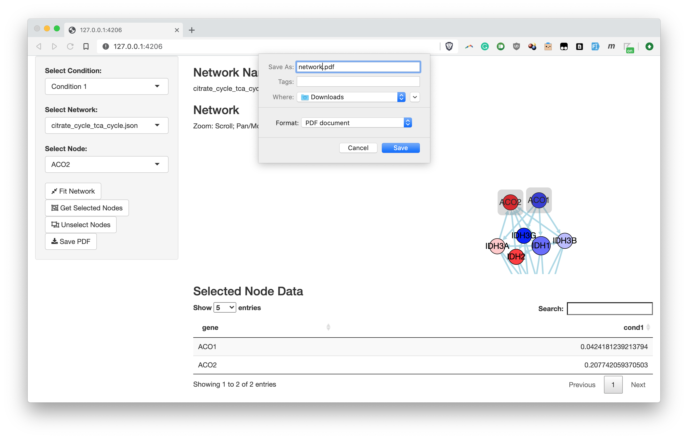

# Introduction 

Example R Shiny application using the [Cytoscape cyjShiny](https://github.com/cytoscape/cyjShiny) widget. The example can: 

* Map data values onto network 
* Switch between networks (e.g., KEGG pathways)
* Display values of selected nodes on table
* Save results to PDF

# Installation 

See shinyNetworkDemoApp.R for necessary packages 

# Run 

shiny::runApp("shinyNetworkDemoApp.R")

# File Descriptions 

* data/conditions.rds: data.frame, rows are genes, columns are include the values of the genes for different conditions (or samples); each gene/condition has been pre-mapped to colors in the colors* columns 
* data/PATHWAY.json: an already laid out network for cytoscape.js 
* data/PATHWAY.rds: igraph version of the network, used for network export 
* default_style.js: configuration for cytoscape.js 
* shinyNetworkDemoApp.R: the Shiny app
* graphToJSON.R: converts graphNEL network to cytoscape.js; compatible with Cytoscape desktop
